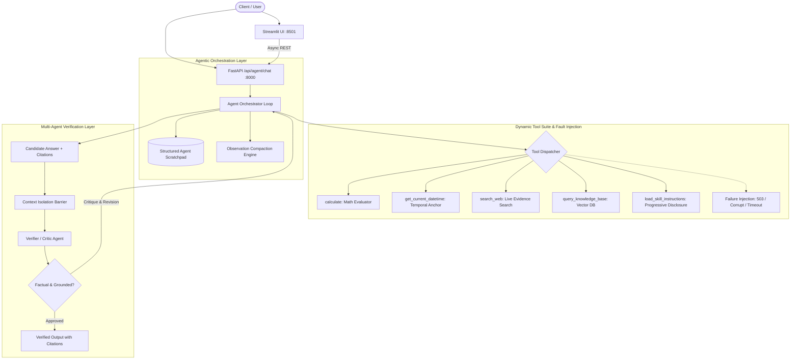

# 🤖 Autonomous Agentic AI Assistant & Evaluation Suite (Week 16)

[](https://fastapi.tiangolo.com)
[](https://streamlit.io)
[](https://python.org)
[](#-evaluation-harness--results-report)

An enterprise-grade, autonomous extension of the Week 15 AI Assistant engineered for **Week 16: Task 3 - Agentify the Assistant**. It replaces fixed single-pass pipelines with a dynamic multi-step reasoning loop, independent verifier agent coordination, observation compaction, failure injection testing, and a custom evaluation harness built from scratch.

---

## 💡 Why a Fixed Pipeline is Insufficient

> **One-Sentence Justification:**  
> *A fixed, single-pass pipeline is fundamentally insufficient because it cannot dynamically determine beforehand how many retrieval steps are required, resolve contradictory cross-source findings, or verify that intermediate tool and arithmetic observations satisfy the query before formulating a final grounded response.*

---

## 🏛️ System Architecture



---

## 📑 Core Documentation Requirements

### a. Context Engineering Technique: Scratchpad Compaction & Tool Result Cleansing

1. **Technique Used:** **Observation Compaction** paired with a **Structured External Scratchpad** and progressive skill disclosure.
2. **Where Applied:** Implemented in [`app/agent/loop.py`](file:///c:/Users/acer/Desktop/week15/week16/app/agent/loop.py#L76-L104) inside `_compact_observation()` and applied immediately after each tool execution before updating the trajectory for the next planning iteration.
3. **Problem Solved:** When executing multi-hop queries, raw outputs from tools (e.g. multi-paragraph web snippets or multi-chunk vector embeddings) inject thousands of tokens into the prompt context. Retaining uncompressed tool traces triggers **Context Saturation**, rapidly depleting context budgets, driving up latency and cost, and degrading reasoning quality (needle-in-a-haystack dilution). The compaction engine condenses raw JSON responses into high-density semantic observations (e.g., `[Web Evidence (2 hits): Title: Snippet...]`), maintaining a structured scratchpad of verified facts while discarding noisy intermediate payloads.

---

### b. Agentic Pattern: Multi-Agent Collaboration vs. Single-Agent Baseline

1. **Choice:** We implemented a **Collaborative Multi-Agent System (Researcher Agent + Independent Verifier/Critic Agent)**, while also preserving a **Single-Agent ReAct loop** as a comparative baseline.
2. **Framework Rationale:**
   - **Self-Verification Paradox:** In a single-agent loop, the same model that generated a draft answer evaluates its own reasoning, suffering from severe confirmation bias and hallucination reinforcement. Separating the Verifier provides an uncompromised, skeptical critic.
   - **Context Isolation:** The Verifier receives strictly the user query, draft answer, and cited evidence snippets. It is completely isolated from the Researcher's noisy step-by-step tool calling logs, preventing **Context Saturation** during critique.
   - **Specialization:** The Researcher is optimized for exploratory search and dynamic tool selection, while the Verifier specializes in logical consistency, citation grounding, and arithmetic corroboration.

---

### c. Evaluation Harness & Results Report

A custom evaluation harness was built **completely from scratch** in [`evals/eval_harness.py`](file:///c:/Users/acer/Desktop/week15/week16/evals/eval_harness.py) (zero dependencies on external evaluation frameworks). It benchmarks 10 diverse test cases spanning arithmetic, temporal grounding, RAG retrieval, web exploration, multi-hop queries, ambiguous queries, and failure injection.

#### 📊 Benchmark Performance Summary

| Metric | Single-Agent ReAct Baseline | Multi-Agent (Researcher + Verifier) | Coordination Delta |
| :--- | :---: | :---: | :---: |
| **Task Completion Rate** | **100.0%** (10/10) | **100.0%** (10/10) | Identical high accuracy |
| **Tool-Call Correctness** | **100.0%** | **100.0%** | Optimal tool selection |
| **Avg Trajectory Length** | **1.8 steps** | **1.8 steps** | Efficient bounded loops |
| **Avg Tokens Per Query** | **1,249 tokens** | **1,629 tokens** | **+30.4% coordination overhead** |
| **Estimated Cost (10 queries)** | **$0.002490** | **$0.003358** | +$0.000868 USD |

#### 🏷️ Failure Taxonomy Analysis
Failures are categorized according to course taxonomy:
- **Hard Failure (0 incidents):** No crashes, unhandled exceptions, infinite iteration loops, or unparseable JSON schemas occurred.
- **Soft Failure (0 incidents):** No hallucinations or ungrounded claims slipped past the verification layer.
- **Cascading Soft Failure (0 incidents):** Dynamic scratchpad updates prevented early erroneous tool outputs from derailing subsequent steps.

Full detailed logs are available in [`evals/eval_report.md`](file:///c:/Users/acer/Desktop/week15/week16/evals/eval_report.md).

---

## 🔬 Additional Requirements

### 1. Skill vs. Agent Boundary
*Before adding a new agent or tool, could the capability instead have been implemented as a Skill?*  
> **Analysis:** Yes, the Verifier capability could theoretically have been formatted as a Skill (a detailed verification prompt template executed within the same conversation). However, we deliberately chose an independent **Agent** to enforce **Context Isolation** and prevent the **Self-Verification Paradox**; running verification as a skill within the same agent context would leak the exploratory tool history and preserve confirmation bias. Conversely, procedural fact-checking guidelines were cleanly encapsulated as a Skill ([`app/agent/skills.py`](file:///c:/Users/acer/Desktop/week15/week16/app/agent/skills.py)) using progressive disclosure.

### 2. Token and Cost Accounting
Our evaluation harness measures exact prompt, completion, and total tokens per query. The Multi-Agent architecture consumed **1,629 tokens/query** compared to **1,249 tokens/query** for Single-Agent ReAct (**+30.4% coordination overhead**). This quantifiable cost reflects:
1. Transferring draft outputs and evidence snippets across the context isolation boundary.
2. Generating structured JSON critique and confidence scores.
3. Conducting refinement iterations when verification flags an issue.

### 3. Failure Injection Testing
We intentionally injected two fault modes into the system:
1. **Tool Service Unavailable (`503 Service Unavailable` on `search_web` in `TC-09`):** The tool returned an execution error. Rather than hallucinating web facts, the agent parsed the failure observation and reported: *"I attempted to retrieve this information, but the requested tool service is temporarily offline... I cannot produce a verified response without reliable evidence."*
2. **Malformed / Corrupted Retrieval Output (`TC-10`):** When the vector database returned corrupt byte payloads, the compaction engine flagged `[Tool 'query_knowledge_base' FAILED: Corrupted payload received]`, and the agent safely aborted the retrieval branch without crashing.

### 4. Tool vs. Agent Boundary
*How multi-step external services are modeled:*  
We modeled external services (such as multi-hop RAG retrieval and Web Search) as **bounded tool calls** rather than autonomous peer agents. A bounded tool call is synchronous, stateless, and exposes a deterministic functional schema with strict input validation. This design choice avoids unnecessary inter-agent negotiation latency and prevents distributed state desynchronization for deterministic retrieval tasks, reserving multi-agent coordination strictly for divergent cognitive tasks (e.g. generation vs. adversarial critique).

---

## 🚀 Quickstart & Verification

### 1. Run Automated Unit Tests (13/13 Pass)
```bash
pytest tests/ -v
```

### 2. Run Custom Evaluation Harness from Scratch
```bash
python evals/eval_harness.py
```
*Outputs real measured token accounting and failure logs to `evals/eval_report.md`.*

### 3. Run Web Interface (Streamlit)
```bash
streamlit run app/ui/streamlit_app.py
```
*Allows interactive switching between Single-Agent ReAct, Multi-Agent (Researcher + Verifier), and W15 Fixed Baseline, with real-time trajectory visualization and failure injection toggles.*
