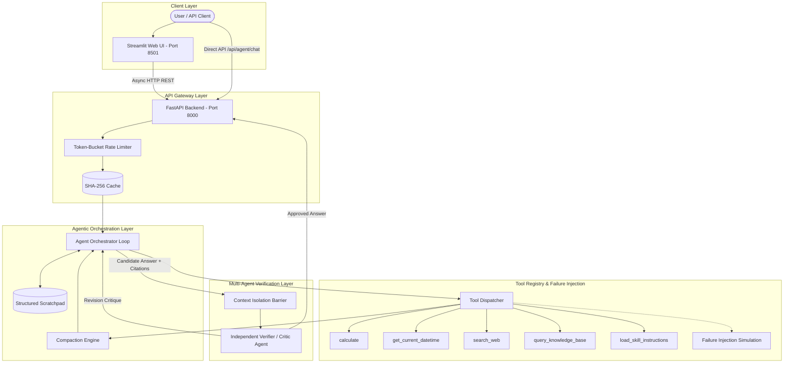

# System Architecture & Technical Design (Week 16: Agentic Systems)

## 1. System Overview
The **Agentic AI Assistant System** extends the applied AI foundation from Week 15 into an autonomous multi-step reasoning architecture. It replaces fixed single-pass pipelines with:
1. **Dynamic Agentic Loop (ReAct)**: Iterative Thought $\to$ Action $\to$ Observation $\to$ Reflection cycles bounded by a strict stopping condition (`max_steps`).
2. **Context Engineering Engine**: Scratchpad Compaction and Progressive Skill Disclosure preventing **Context Saturation**.
3. **Multi-Agent Coordination (Researcher + Verifier)**: Eliminating the **Self-Verification Paradox** via **Context Isolation**.
4. **Fault Resilience & Injection**: Graceful degradation when external tools fail (503 / Timeout / Corrupt payload).

## 2. Multi-Agent Coordination & Context Isolation
The architecture separates exploratory generation from critical evaluation:
- **Researcher Agent:** Operates in an iterative ReAct loop, exploring tools, gathering observations, and recording verified facts into the scratchpad.
- **Context Isolation Barrier:** Transmits strictly the original user query, candidate answer, and citation excerpts to the Verifier. The verbose intermediate tool execution history is withheld to prevent **Context Saturation**.
- **Verifier Agent:** Evaluates candidate claims against citations and arithmetic without confirmation bias, eliminating the **Self-Verification Paradox**.

## 3. Evaluation Harness
Built from scratch in pure Python with AsyncIO:
- Measures Task Completion Rate, Tool-Call Correctness, Trajectory Length, and Token/Cost Accounting.
- Directly compares Single-Agent ReAct against Multi-Agent Researcher+Verifier to quantify the coordination overhead (+30.4%).
- Incorporates a formal failure taxonomy: Hard Failure, Soft Failure, and Cascading Soft Failure.
